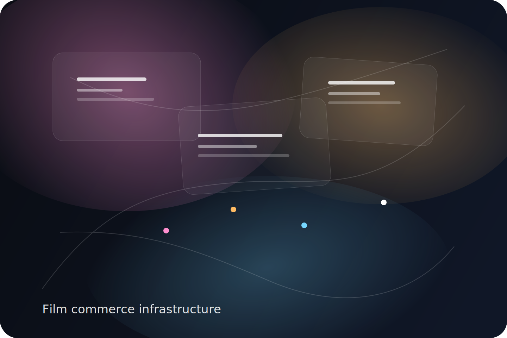

<!doctype html>
<html lang="en">
<head>
  <meta charset="utf-8">
  <meta name="viewport" content="width=device-width, initial-scale=1, viewport-fit=cover">
  <title>For Investors | UNBURIED Screen Network</title>
  <meta name="description" content="A category bet on creator-controlled film commerce, local screening rights, modular payment rails, and artist-owned distribution infrastructure.">
  <meta name="theme-color" content="#090b12">
  <meta name="robots" content="index,follow,max-image-preview:large,max-snippet:-1,max-video-preview:-1">
  <link rel="canonical" href="https://YOURDOMAIN.com/investors.html">
  <link rel="icon" href="assets/icons/favicon.svg" type="image/svg+xml">
  <link rel="manifest" href="site.webmanifest">
  <meta property="og:type" content="website">
  <meta property="og:title" content="For Investors | UNBURIED Screen Network">
  <meta property="og:description" content="A category bet on creator-controlled film commerce, local screening rights, modular payment rails, and artist-owned distribution infrastructure.">
  <meta property="og:url" content="https://YOURDOMAIN.com/investors.html">
  <meta property="og:image" content="https://YOURDOMAIN.com/assets/placeholders/og-cover.svg">
  <meta name="twitter:card" content="summary_large_image">
  <meta name="twitter:title" content="For Investors | UNBURIED Screen Network">
  <meta name="twitter:description" content="A category bet on creator-controlled film commerce, local screening rights, modular payment rails, and artist-owned distribution infrastructure.">
  <meta name="twitter:image" content="https://YOURDOMAIN.com/assets/placeholders/og-cover.svg">
  <link rel="preconnect" href="https://fonts.googleapis.com">
  <link rel="preconnect" href="https://fonts.gstatic.com" crossorigin>
  <link href="https://fonts.googleapis.com/css2?family=Inter:wght@400;500;600;700;800;900&family=Space+Grotesk:wght@500;700&display=swap" rel="stylesheet">
  <link rel="stylesheet" href="styles.css">
  
  
  
</head><body>
  

  <a class="skip-link" href="#main">Skip to content</a>
  <header class="site-header" id="top">
    

      <a class="brand" href="index.html" aria-label="UNBURIED Screen Network home">
        
        
          UNBURIED
          Screen Network
        
      </a>
      <button class="nav-toggle" aria-label="Open menu" aria-expanded="false" aria-controls="nav-links">
        
      </button>
      <nav class="nav-links" id="nav-links">
        <a href="index.html">Home</a>
        <a href="filmmakers.html">Filmmakers</a>
        <a href="hosts.html">Hosts</a>
        <a href="investors.html">Investors</a>
        <a href="index.html#waitlist" class="nav-cta">Get early access</a>
      </nav>
    

  </header>
  <main id="main">
<section class="page-hero page-hero-investors">
  

    

      For investors and strategic partners
      <h1 class="display-title display-title-page">This is not another media bet. It is a seller network for films the current system cannot place cleanly.</h1>
      
UNBURIED sits at the intersection of creator commerce, rights infrastructure, community distribution, and resilient payment rails. The category is film. The architecture is closer to seller tooling.

      

        <a class="btn btn-primary" href="#investor-form">Request the investor thesis</a>
        <a class="btn btn-secondary" href="#why-now">See why now</a>
      

    

    

      
    

  

</section>

<section id="why-now">
  

    

      Why the category is opening
      <h2>Important films are underserved, direct support is normalized, and the rails under the rails are finally getting better.</h2>
      
The old answer was “hope a streamer says yes.” The new answer is a more diversified release machine: direct viewing, local screening rights, educational access, support campaigns, and optional sovereign rails where they actually matter.

    

    <aside class="pull-quote-card">
      
The platform does not need to out-feed incumbents. It needs to own a sharper lane and a better transaction model.

    </aside>
  

</section>

<section>
  

    <article class="bento-card bento-wide">
      The thesis
      <h3>A premium screen network for culturally important films facing structural distribution resistance.</h3>
      
The wedge is high-friction cinema first. The umbrella brand is broader: an independent film network with stronger monetization, cleaner rights mechanics, and audience ownership built in.

    </article>
    <article class="bento-card">
      What the market keeps missing
      <h3>There is no integrated operator for this</h3>
      
Crowdfunding, streaming, community screenings, and crypto experiments all exist. The filmmaker still has to stitch them together alone.

    </article>
    <article class="bento-card">
      Why this can compound
      <h3>Each film strengthens the network</h3>
      
Hosts, educators, buyers, supporters, affiliates, and curators become reusable infrastructure for the next release.

    </article>
    <article class="bento-card">
      Why this can defend itself
      <h3>Transaction-first beats ad dependence</h3>
      
Revenue comes from watching, hosting, licensing, and backing films — not from chasing low-quality scale and fragile brand-safe advertising.

    </article>
  

</section>

<section>
  

    The shape of the business
    <h2>Broad umbrella. Sharp wedge. Multiple monetization lanes. Modular rails.</h2>
  

  

    <article class="feature-card">01<h3>Primary revenue</h3>
VOD rentals, purchases, gifts, and memberships later.
</article>
    <article class="feature-card">02<h3>High-margin layer</h3>
Community screenings, educational licenses, and local rights packages.
</article>
    <article class="feature-card">03<h3>Support layer</h3>
Pre-sales, completion funds, and launch-support campaigns for upcoming titles.
</article>
    <article class="feature-card">04<h3>Resilience layer</h3>
Mainstream payments on top, self-hosted or stablecoin options underneath where they reduce real risk.
</article>
  

</section>

<section class="section-contrast">
  

    

      For Jack Dorsey and investors like him
      <h2>If you are bullish on seller infrastructure, artist-owned rails, optional bitcoin payments, and self-custody that does not punish normal users, this should already feel legible.</h2>
      <ul class="checklist">
        <li>It serves creators as sellers, not as content inputs for a feed.</li>
        <li>It benefits from simpler, more open payment infrastructure as that stack matures.</li>
        <li>It treats portability and sovereignty as product advantages, not ideological decoration.</li>
        <li>It can use bitcoin and self-custody as optional leverage, not mandatory consumer friction.</li>
      </ul>
    

    

      
<strong>Closer category analogy</strong>seller tools + rights marketplace + artist commerce infrastructure

      
<strong>Not the analogy</strong>generic streaming or ad-supported “alternative YouTube” scale chase

      
<strong>Underlying bet</strong>the creators with the hardest distribution problem are often the most motivated to adopt better rails first

    

  

</section>

<section>
  

    Execution discipline
    <h2>How to build a category-defining product without dying of ambition</h2>
  

  

    <article class="workflow-card">Phase 0<h3>Foundation</h3>
Curated titles, filmmaker onboarding, direct checkout, secure playback, screening requests, reserves, and payouts.
</article>
    <article class="workflow-card">Phase 1<h3>Closed beta</h3>
25 to 75 films, local screening pilots, event pages, support campaigns, and role-specific waitlists.
</article>
    <article class="workflow-card">Phase 2<h3>Resilience</h3>
Expanded rights logic, better creator analytics, fallback rails, educational licensing, and audience export.
</article>
    <article class="workflow-card">Phase 3<h3>Treasury + category depth</h3>
Stablecoin settlement options, higher-end DRM, partner white labels, and regulated investment handoff for selected titles.
</article>
  

</section>

<section id="investor-form" class="section-waitlist">
  

    

      For investors and strategic partners
      <h2>Request the Narrative Sovereignty Thesis.</h2>
      
Get the sharp version: category map, business model, risk architecture, phased rollout, and why this looks more like infrastructure than entertainment hype.

      <ul class="checklist">
        <li>The market wedge and why high-friction films go first</li>
        <li>The money logic, reserves, and marketplace architecture</li>
        <li>The case for modular rails and creator-owned relationships</li>
      </ul>
    

    

      <h3>Request the thesis</h3>
      <form action="https://formspree.io/f/YOUR_INVESTOR_FORM_ID" method="POST" class="form-grid">
        <input type="hidden" name="form_name" value="Investor Inquiry">
        <label>Name<input type="text" name="name" required></label>
        <label>Email<input type="email" name="email" required></label>
        <label>Organization<input type="text" name="organization"></label>
        <label>Interest type
          <select name="interest">
            <option>Angel / early investor</option>
            <option>Strategic partner</option>
            <option>Payments / wallet infrastructure</option>
            <option>Distribution / venue partner</option>
            <option>Philanthropic / ecosystem support</option>
          </select>
        </label>
        <label>What about this category feels most investable to you?<textarea name="note" placeholder="Seller infrastructure, artist commerce, open money alignment, category timing, cultural thesis, or another angle."></textarea></label>
        <button class="btn btn-primary btn-block" type="submit">Send me the investor thesis</button>
      </form>
    

  

</section>

  </main>
  

    <a href="index.html#waitlist" class="btn btn-primary btn-block">Get early access</a>
  

  <footer class="site-footer">
    

      

        
UNBURIED Screen Network

        
A filmmaker-first screen network for films that deserve circulation, not quiet disappearance.

      

      

        
Explore

        <a href="filmmakers.html">For filmmakers</a>
        <a href="hosts.html">For hosts</a>
        <a href="investors.html">For investors</a>
      

      

        
Primary promise

        
Keep rights. Own audience. Activate direct revenue, local screening rights, and resilient distribution rails in one premium system.

      

      

        
Why investors stay close

        
Because this category will reward the partners who understand it early, before the first serious network effects and rights relationships become obvious to everyone else.

      

    

  </footer>
  
</body>
</html>